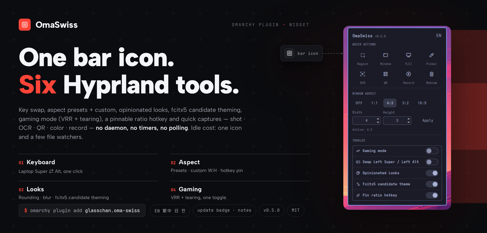

# OmaSwiss

English · [繁體中文](README.zh-Hant.md)

[](https://github.com/glasschan/oma-swiss/actions/workflows/ci.yml)



**One bar icon. Five Hyprland tools.**

Swap your laptop's Super and Alt keys, lock the lone window to any aspect
ratio, restyle your desktop, tune for gaming, and capture your screen — all
from one popup that costs nothing while you're not using it.

## Why you'll keep it installed

- **One popup, no terminal.** Every tool is a toggle, one left-click away.
  Right-click the bar icon to flip the Super⇄Alt swap instantly.
- **Idle cost: one bar icon.** No daemon, no timers, no polling. When the
  popup is closed, the plugin is effectively asleep.
- **Survives updates and relogins.** Toggles write the same state files
  Omarchy itself uses, so your settings hold across reloads, reboots, and
  `omarchy update` — and the Omarchy menu keeps working alongside.
- **Four UI languages.** English, 繁體中文, 日本語, and 한국어 from one
  header menu. The Japanese and Korean translations are machine-assisted —
  improvements welcome via PR.
- **Told when an update lands.** A badge on the panel marks new GitHub
  releases, with the release notes in its tooltip; one click updates the
  plugin on git installs. The check runs at most once a day — never on a
  timer.

## The five tools

- **Super ⇄ Alt swap** — Mac-style modifier keys on the built-in laptop
  keyboard, whenever you want them. External keyboards are never touched.
- **Single-window aspect ratio** — keep the lone window honest: 1:1, 4:3,
  3:2, and 16:9 presets, or any custom `W:H` up to 64. Your ratio survives
  reloads and logins, and the stock `SUPER+CTRL+BACKSPACE` binding works
  alongside it.
- **Opinionated Looks** — rounded corners, a translucent 5px border, soft
  shadows, and vibrancy blur in one toggle. Switch it off and you're back to
  stock Omarchy, exactly.
- **Gaming mode** — variable refresh (VRR) and tearing allowed in one
  toggle, for the lowest input latency. Switch it off and the stock values
  return, exactly.
- **Quick capture** — region / window / fullscreen screenshots, a color
  picker, OCR (English + 中文), QR scan (decoded text lands in the
  clipboard), and screen recording start/stop with or without your webcam,
  one click each. Capture overlays need a clear screen, so the panel closes
  as the tool fires.

## Day to day

- **Left-click** the bar icon: open the tools popup.
- **Right-click**: instant Super⇄Alt toggle.
- **Middle-click**: instant region screenshot (Esc cancels).
- **Pin the hotkey** (optional): while pinned, `SUPER+CTRL+BACKSPACE`
  cycles off ⇄ *your last ratio* instead of the stock fixed 1:1 — set 16:9
  in the panel and the hotkey follows. Unpinning restores the previous
  binding exactly, and the Omarchy menu's own ratio entry is never touched.

Every command also works from the shell, so you can bind it to anything:

```bash
omarchy-shell glasschan.oma-swiss toggle         # Super⇄Alt on/off
omarchy-shell glasschan.oma-swiss aspect 21 10   # any custom ratio
omarchy-shell glasschan.oma-swiss aspectOff      # ratio off
omarchy-shell glasschan.oma-swiss aspectToggle   # off <-> last ratio
omarchy-shell glasschan.oma-swiss pin            # pin/unpin the hotkey
omarchy-shell glasschan.oma-swiss look           # looks on/off
omarchy-shell glasschan.oma-swiss gaming         # gaming mode on/off
omarchy-shell glasschan.oma-swiss lang           # cycle UI language en→zh→ja→ko
omarchy-shell glasschan.oma-swiss panel          # open/close popup
omarchy-shell glasschan.oma-swiss status         # what's on right now
```

## Install / Remove

```bash
omarchy plugin add <this repo's git URL>    # install
omarchy plugin remove glasschan.oma-swiss   # remove
```

Before removing, switch every toggle off in the panel. Each toggle leaves a
small state file that re-applies your setting at login — switching it off
deletes the file, so nothing outlives the plugin.

## Dependencies

None to install — everything ships with Omarchy v4: Hyprland 0.56+,
`omarchy-capture-screenshot` (slurp), `omarchy-capture-text` (OCR),
`omarchy-capture-qr` (zbar), `omarchy-capture-screenrecording` and
`omarchy-capture-screenrecording-with-webcam` (gpu-screen-recorder), and
`hyprpicker`.
`jq` (present on a stock Omarchy install) is used, when available, to show
release notes for pending updates — the update check works without it.

MIT.
